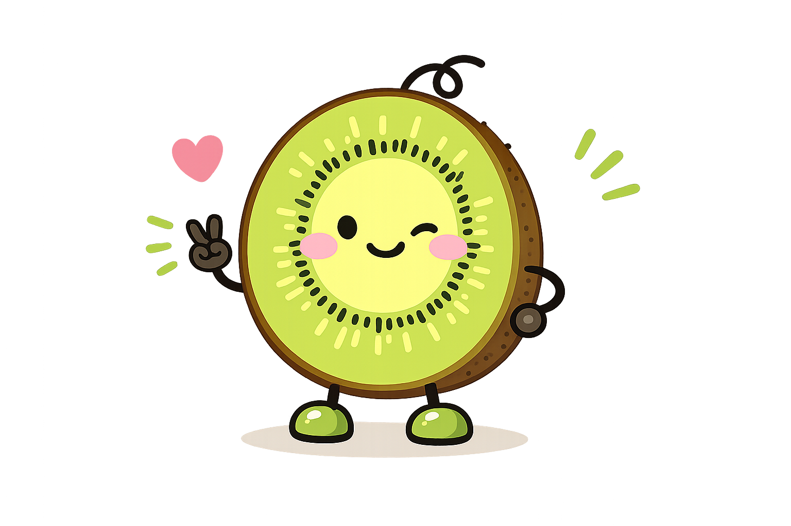

<p align="center">
  
</p>

<h1 align="center">KiwiFS</h1>

<p align="center">
  <strong>Markdown filesystem for agents and teams.</strong>
</p>

<p align="center">
  Searchable. Structured. Versioned. One binary, zero config.
</p>

<p align="center">
  <a href="https://github.com/kiwifs/kiwifs/actions/workflows/ci.yml"></a>
  <a href="LICENSE"></a>
  <a href="https://github.com/kiwifs/kiwifs"></a>
  <a href="https://hub.docker.com/r/ameliaanhlam/kiwifs"></a>
  <a href="https://github.com/kiwifs/kiwifs"></a>
  <a href="https://github.com/kiwifs/kiwifs"></a>
</p>

<p align="center">
  <a href="https://docs.kiwifs.com">Docs</a> · <a href="docs/API.md">API</a> · <a href="https://demo.kiwifs.com">Demo</a> · <a href="docs/EXAMPLES.md">Examples</a> · <a href="docs/FAQ.md">FAQ</a> · <a href="docs/ROADMAP.md">Roadmap</a> · <a href="docs/ARCHITECTURE.md">Architecture</a> · <a href="CONTRIBUTING.md">Contributing</a>
</p>

```bash
curl -fsSL https://raw.githubusercontent.com/kiwifs/kiwifs/main/install.sh | sh
kiwifs init --root ./knowledge && kiwifs serve --root ./knowledge
# Open http://localhost:3333
```

**Or with Docker:**

```bash
docker run -p 3333:3333 -v ./knowledge:/data ameliaanhlam/kiwifs
```

---

## The problem

Markdown is the lingua franca of agents and developers, but raw `.md` files are just files. No search, no versioning, no structure. Current solutions make you choose: databases agents can't read, read-only retrieval layers agents can't write to, ephemeral sandboxes that vanish, or proprietary SaaS you can't self-host.

KiwiFS makes markdown files writable, searchable, queryable, versioned, and human-readable. Files are the source of truth. Everything else is a derivative index you can rebuild.

```
AGENT                              HUMAN
cat /kiwi/pages/auth.md            Web UI (wiki links, graph view,
grep -r "timeout" /kiwi/             block editor, dark mode)
echo "# Report" > /kiwi/r.md      Cmd+K search, backlinks, TOC

       |                                |
     Markdown files on disk (single source of truth)
       |                |              |
    Git versioning   FTS5 + vector   SSE events
    (audit trail)    (search index)  (live updates)
```

---

## Features

| | |
|---|---|
| **62 MCP tools** | Native integration with Claude, Cursor, and any MCP client. [Docs](https://docs.kiwifs.com/concepts/mcp) |
| **Web UI** | Wiki links, backlinks, graph view, block editor, dark mode. Embedded via `go:embed`. [Demo](https://demo.kiwifs.com) |
| **Full-text + vector search** | BM25 via SQLite FTS5. Pluggable vector: OpenAI, Ollama, Cohere + sqlite-vec, Qdrant, pgvector, Pinecone. [Docs](https://docs.kiwifs.com/concepts/search) |
| **Git versioning** | Every write is an atomic commit. Blame, diff, point-in-time restore. [Docs](https://docs.kiwifs.com/concepts/versioning) |
| **DQL queries** | SQL-like queries over frontmatter. `TABLE`, `LIST`, `COUNT`, `WHERE`, `SORT`, `GROUP BY`. [Docs](https://docs.kiwifs.com/concepts/dql) |
| **6 access protocols** | REST, MCP, NFS, S3, WebDAV, FUSE. All flow through one storage layer. [Docs](https://docs.kiwifs.com/concepts/agent-interface) |
| **19 data importers** | Postgres, MySQL, MongoDB, Notion, CSV, Obsidian, and more. [Docs](https://docs.kiwifs.com/import/overview) |
| **Content health** | Stale page detection, broken links, orphans, contradiction finder, trust-ranked search. [Docs](https://docs.kiwifs.com/api/analytics) |
| **Multi-space** | One server, multiple isolated workspaces. Each with its own git repo and search index. |
| **Webhooks** | POST to Slack/CI/custom URLs on write/delete events. HMAC signing, retry with backoff. [Docs](https://docs.kiwifs.com/concepts/webhooks) |
| **Schema validation** | Enforce structure with JSON Schema on writes. [Docs](https://docs.kiwifs.com/concepts/schemas) |
| **Wiki links** | `[[page]]` syntax with backlinks, knowledge graph visualization. [Docs](https://docs.kiwifs.com/concepts/wiki-links) |
| **Data export** | JSONL/CSV with optional embeddings, link graph, and content. [Docs](https://docs.kiwifs.com/export/overview) |
| **CLI** | 25+ commands: `serve`, `mcp`, `query`, `import`, `export`, `lint`, `connect`, and more. [Docs](https://docs.kiwifs.com/cli/commands) |
| **Embeddable** | Use as a Go library (`pkg/kiwi`) in your own app. [Docs](https://docs.kiwifs.com/deploy/go-embed) |

[See all features and configuration](https://docs.kiwifs.com)

---

## Quickstart

```bash
# Install (macOS / Linux)
brew install kiwifs/tap/kiwifs
# or: curl -fsSL https://raw.githubusercontent.com/kiwifs/kiwifs/main/install.sh | sh
# or: go install github.com/kiwifs/kiwifs@latest

# Initialize
kiwifs init --template knowledge --root ./knowledge

# Serve
kiwifs serve --root ./knowledge
# REST API on :3333, web UI at http://localhost:3333

# Write from an agent
curl -X PUT 'localhost:3333/api/kiwi/file?path=pages/auth.md' \
  -H "X-Actor: my-agent" \
  -d "# Authentication\n\nOAuth2 + JWT..."
```

---

## Connect your AI tools

**Local (Claude Desktop / Cursor / any MCP client):**

```json
{
  "mcpServers": {
    "kiwifs": {
      "command": "kiwifs",
      "args": ["mcp", "--root", "/path/to/knowledge"]
    }
  }
}
```

**Cloud (KiwiFS Cloud workspace):**

```json
{
  "mcpServers": {
    "kiwi": {
      "url": "https://api.kiwifs.com/api/workspaces/my-workspace/mcp",
      "headers": { "Authorization": "Bearer ${env:KIWI_API_KEY}" }
    }
  }
}
```

Or auto-configure all detected clients with one command:

```bash
kiwifs connect my-workspace --write auto
```

---

## How it compares

| | KiwiFS | Git repo | Postgres | Obsidian | Chroma |
|---|---|---|---|---|---|
| **What it is** | Markdown filesystem | DIY files + git | Relational database | Local markdown editor | Vector store (OSS) |
| **Agents can write** | MCP, REST, `cat` | `echo` + manual commit | SQL inserts | Local files only | Upsert embeddings |
| **MCP support** | Native (62 tools) | No | No | No | No |
| **Human-readable UI** | Built-in web UI | Raw files / GitHub | Needs custom UI | Desktop app | No |
| **Search** | FTS (BM25) + vector | `grep` | SQL `LIKE` / pg_trgm | Plugins | Vector similarity |
| **Structured queries** | DQL over frontmatter | No | SQL (full power) | Plugin (Dataview) | Metadata filters |
| **Versioning** | Auto git commits | Manual | WAL / migrations | No | No |
| **Data format** | Markdown (portable) | Markdown (portable) | Tables (locked in) | Markdown (portable) | Embeddings (opaque) |
| **Best for** | Agent workspace + team wiki | Simple scripts | App backends | Personal notes | OSS semantic search |

---

## Who this is for

**AI agent builders** — Your agents write markdown via MCP, REST, or `cat`. Humans browse the same files in a web UI with wiki links and graph view. Context compounds across sessions instead of vanishing.

**Teams replacing Confluence / Notion** — Markdown files on disk, wiki links, graph view, Notion-like editor. `git clone` your entire wiki. Self-hosted. No vendor lock-in.

**Compliance-heavy industries** — Every change is a git commit with SHA-1 hash chain. Immutable audit trail. `git blame` for per-line attribution.

**DevOps / platform teams** — Runbooks that agents update after every incident. Humans review in the UI. No more docs that rot.

---

## Architecture

```
┌──────────────────────────────────────────────────────────┐
│  KiwiFS                                    single Go binary
│                                                          │
│  ┌────────────────────────────────────────────────────┐  │
│  │  Web UI (embedded via go:embed)                    │  │
│  │  shadcn/ui · CodeMirror · react-markdown · Sigma.js│  │
│  └────────────────────┬───────────────────────────────┘  │
│                       │                                  │
│  ┌────────────────────▼───────────────────────────────┐  │
│  │  Access: REST :3333 · NFS :2049 · S3 :3334 · WebDAV│  │
│  └────────────────────┬───────────────────────────────┘  │
│                       │                                  │
│  ┌────────────────────▼───────────────────────────────┐  │
│  │  Core                                              │  │
│  │  Storage · Git versioning · FTS5 + Vector search   │  │
│  │  Watcher (fsnotify) · SSE events · Schema/lint     │  │
│  └────────────────────┬───────────────────────────────┘  │
│                       │                                  │
│  ┌────────────────────▼───────────────────────────────┐  │
│  │  Filesystem: local · NFS · EFS · JuiceFS · FUSE-S3 │  │
│  └────────────────────────────────────────────────────┘  │
└──────────────────────────────────────────────────────────┘
```

---

## Community Integrations

Built something on KiwiFS? [Open a discussion](https://github.com/kiwifs/kiwifs/discussions) and we'll list it here.

| Project | Description | Author |
|---------|-------------|--------|
| [pi-kiwifs-extension](https://github.com/jontstaz/pi-kiwifs-extension) | Full KiwiFS integration for the Pi coding agent | [@jontstaz](https://github.com/jontstaz) |

---

## Inspired by

- **[PocketBase](https://pocketbase.io)** — single Go binary, zero config, just works. KiwiFS brings the same philosophy to markdown infrastructure.
- **[Obsidian](https://obsidian.md)** — files are the database. Wiki links. Graph view. KiwiFS is Obsidian for the web, plus agents and an API.
- **[Karpathy's LLM Wiki](https://gist.github.com/karpathy/442a6bf555914893e9891c11519de94f)** — raw sources in, compiled wiki out, agent maintains it. KiwiFS is the production runtime for this pattern.
- **[Notion](https://notion.so)** / **[Confluence](https://www.atlassian.com/software/confluence)** — great UIs, but your content is locked in their database and agents can't use them. KiwiFS gives you the editing experience without the lock-in.

## License

[Business Source License 1.1](LICENSE) — free to use, self-host, and modify. The only restriction: you can't offer KiwiFS as a commercial hosted service. Each release converts to Apache 2.0 after 4 years.

If you want to offer KiwiFS as a managed service or need a commercial license, [get in touch](mailto:amelia.anh.lam@gmail.com).

"KiwiFS" and the KiwiFS logo are trademarks of the KiwiFS Authors. See [LICENSE](LICENSE) for trademark usage guidelines.

## Star History

<a href="https://star-history.com/#kiwifs/kiwifs&Date">
  <picture>
    <source media="(prefers-color-scheme: dark)" srcset="https://api.star-history.com/svg?repos=kiwifs/kiwifs&type=Date&theme=dark" />
    <source media="(prefers-color-scheme: light)" srcset="https://api.star-history.com/svg?repos=kiwifs/kiwifs&type=Date" />
    
  </picture>
</a>

## Contributors

Thanks to everyone who has contributed to KiwiFS.

<a href="https://github.com/amelia751"></a>
<a href="https://github.com/hermes-agent"></a>
<a href="https://github.com/shoveller"></a>
<a href="https://github.com/jasperdevs"></a>
<a href="https://github.com/KavishShah15"></a>
<a href="https://github.com/Avuru02"></a>
<a href="https://github.com/SAY-5"></a>
<a href="https://github.com/PranavChahal"></a>
<a href="https://github.com/nanookclaw"></a>

Want to help? See [CONTRIBUTING.md](CONTRIBUTING.md).
